# z-one Codebase Overview

本文档旨在为开发者提供 `z-one` 项目的详细技术概览，帮助快速理解项目结构、核心模块依赖关系及关键业务流程。

## 1. 项目简介

`z-one` 是一个基于 **Electron** 构建的分布式 AI 代理（Agent）协作系统。它不仅仅是一个聊天机器人，更是一个能够操作桌面、浏览器和外部设备的智能中枢。

**核心特性：**
*   **多 Agent 协作 (Swarm)**: 能够根据任务复杂度自动组建 Agent 团队，分工协作。
*   **DAG 工作流引擎**: 支持循环、条件分支、网关并行、AI 条件评估的高级工作流系统。
*   **跨平台交互**: 支持桌面应用、浏览器插件、飞书机器人、CLI 等多种终端接入。
*   **本地感知能力**: 集成 `localModel` (UI-TARS)，具备屏幕视觉理解和 GUI 自动化能力。
*   **长期记忆 (RAG)**: 内置向量数据库，支持基于语义的历史记录检索。
*   **CLI 远程控制**: WebSocket 远程控制 + 结构化测试框架。

## 2. 技术架构

项目采用经典的 **Electron (Main + Renderer)** 架构，并引入了 **Interaction Layer** 作为中枢神经。

```mermaid
graph TD
    User["用户/终端"] --> Renderer["渲染进程 UI"]
    User --> External["外部设备 飞书等"]
    CLI["CLI Client _zone_cli"] -->|ws://localhost:18888| Interaction
    
    subgraph MainProcess ["Electron Main Process"]
        Renderer <-->|WebSocket| Interaction["Interaction Layer"]
        External <-->|WebSocket| Interaction
        
        Interaction --> Planner["Planner 智能规划"]
        Interaction -->|remote_control| RemoteCtrl["handleRemoteControl()"]
        Planner --> Memory["Memory 记忆系统"]
        Planner --> Team["Team Orchestrator 团队编排"]
        
        Team --> Agent1["Agent: Researcher"]
        Team --> Agent2["Agent: Operator"]
        
        Agent1 --> Tools["Tool Registry"]
        Agent2 --> Tools
        
        Tools --> WFTool["create_workflow"]
        WFTool --> WFPlanner["WorkflowPlanner"]
        WFPlanner --> WFEngine["WorkflowEngine"]
        
        Tools --> MCP["MCP Hub"]
        Tools --> Native["Native Tools"]
    end
    
    subgraph LocalServices ["Local Services"]
        Native --> LocalModel["Python LocalModel UI-TARS"]
        MCP --> FileSystem["FS MCP Server"]
        MCP --> Browser["Browser MCP Server"]
    end
```



## 3. 目录结构说明

```
z-one/
├── localModel/             # Python 本地模型服务 (UI-TARS)
│   ├── app.py              # FastAPI 服务入口
│   └── requirements.txt    # Python 依赖
├── src/
│   ├── main/               # Electron 主进程 (核心业务逻辑)
│   │   ├── agent/          # Agent 基类与实现
│   │   ├── control/        # 任务管理与 MCP 连接
│   │   ├── device/         # 外部设备接入 (如 Lark)
│   │   ├── execution/      # 工具执行层 (Native & MCP)
│   │   │   └── tools/workflow/  # create_workflow / confirm_workflow 工具
│   │   ├── intelligence/   # 智能规划与分诊 (Planner, Triage)
│   │   ├── interaction/    # WebSocket 交互层
│   │   │   ├── manager.ts  # WebSocket Server + remote_control 处理
│   │   │   ├── dom-query.ts # 紧凑 DOM 序列化 (注入前端JS)
│   │   │   └── types.ts    # 协议类型定义
│   │   ├── memory/         # 向量记忆与文件存储
│   │   ├── model/          # LLM 服务适配器
│   │   ├── team/           # 多 Agent 编排 (Swarm)
│   │   ├── workflow/       # 工作流引擎
│   │   │   ├── engine.ts   # DAG 执行引擎
│   │   │   ├── planner.ts  # LLM 工作流规划
│   │   │   ├── store.ts    # SQLite 持久化
│   │   │   └── types.ts    # 工作流类型定义
│   │   ├── cli.ts          # CLI 客户端 (WS remote_control)
│   │   ├── cli-test-runner.ts # 结构化测试运行器
│   │   ├── db.ts           # SQLite 数据库管理
│   │   └── index.ts        # 主进程入口
│   ├── preload/            # Electron 预加载脚本
│   │   └── index.ts        # IPC API 暴露 (含 workflow API)
│   └── renderer/           # Electron 渲染进程 (React UI)
│       └── src/
│           ├── components/
│           │   ├── App.tsx              # 应用入口, Chat/Workflow 视图切换
│           │   ├── MessageList.tsx      # 消息列表 + Proposal 卡片
│           │   ├── WorkflowListPage.tsx # 工作流列表
│           │   ├── WorkflowDetailPage.tsx # 工作流 DAG 详情
│           │   ├── SwarmBoard.tsx       # Swarm 状态板
│           │   └── ChatInput.tsx        # 聊天输入
│           ├── services/
│           │   ├── workflow-service.ts  # 工作流 IPC 封装
│           │   └── interaction-client.ts # WebSocket 客户端
│           └── hooks/      # React Hooks (useSessions)
├── tests/                  # 结构化测试
│   ├── core.test.json      # Core UI 测试套件
│   ├── workflow-deep.test.json  # Workflow IPC 深度测试
│   ├── workflow-e2e.test.json   # Workflow E2E 生命周期测试
│   └── screenshots/        # 测试截图
├── workspace/              # 运行时生成的文件 (日志, 记忆, 任务)
├── electron.vite.config.ts # 构建配置
└── package.json            # 项目依赖
```

## 4. 核心模块详解 (src/main)

### 4.1 Interaction (交互层)
*   **路径**: `src/main/interaction/`
*   **职责**: 系统的门户。启动 WebSocket 服务（默认端口 18888），统一管理所有连接（Renderer, External Devices, CLI）。
*   **关键类**: `InteractionManager`。处理鉴权（token 写入 `/tmp/z-one-cli-token`）、心跳、消息路由。
*   **Remote Control**: 处理 CLI 发送的 `remote_control` 消息（screenshot, dom, click, type, eval, scroll）。
*   **DOM 查询**: `dom-query.ts` 注入前端 JS 生成紧凑 DOM 表示（~200-500 tokens vs HTML 5000+）。

### 4.2 Intelligence (智能层)
*   **路径**: `src/main/intelligence/`
*   **职责**: 系统的"大脑"。
*   **关键组件**:
    *   `Planner`: 接收用户输入，协调记忆检索和任务分发。
    *   `TriageAgent`: 任务分诊。判断任务是简单对话还是需要复杂编排，决定是否启动 `TeamOrchestrator`。

### 4.3 Team (编排层)
*   **路径**: `src/main/team/`
*   **职责**: 实现 **Swarm 模式**。
*   **流程**: 当任务复杂时，`TeamOrchestrator` 会生成 `TeamPlan`，动态创建所需的 Agent 角色（如 "Web Researcher", "Code Reviewer"），并管理它们的并行或串行执行。

### 4.4 Agent (代理层)
*   **路径**: `src/main/agent/`
*   **职责**: 定义 Agent 的行为规范。
*   **实现**: 封装了 LLM 的 ReAct 循环（思考-行动-观察），管理对话历史上下文（支持 Context Compression），并调用工具。

### 4.5 Execution (执行层)
*   **路径**: `src/main/execution/`
*   **职责**: 工具的注册与执行。
*   **ToolRegistry**: 统一管理 Native Tools 和 MCP Tools。
*   **Tools**:
    *   `browser/`: Playwright 浏览器自动化。
    *   `desktop/`: 桌面控制能力。
    *   `tars/`: UI-TARS 视觉操作工具。
    *   `workflow/`: 工作流创建/确认工具（`create_workflow`, `confirm_workflow`）。
    *   `mcp-hub.ts`: 连接外部 MCP Server。

### 4.6 Memory (记忆层)
*   **路径**: `src/main/memory/`
*   **职责**: 长短期记忆管理。
*   **实现**:
    *   `MemoryManager`: 核心管理类。
    *   `indexer.ts`: 负责将文件（Markdown, Code）切片并存入向量库。
    *   `store.ts`: 基于 `sqlite-vec` 和 `better-sqlite3` 实现的本地向量存储。

### 4.7 Workflow (工作流引擎)
*   **路径**: `src/main/workflow/`
*   **职责**: DAG 工作流的规划、持久化与执行。
*   **关键组件**:
    *   `engine.ts`: 工作流执行引擎。支持 Task/Condition/Loop/Gateway 节点类型，拓扑排序执行，AI 条件评估（结构化 JSON 返回 `{result: true/false}`），跳过传播。
    *   `planner.ts`: 通过 LLM 生成/优化工作流 DAG（含节点位置、边、Agent 配置）。支持自省优化（`reflectAndRefine`）。
    *   `store.ts`: SQLite 持久化（workflows, workflow_versions, workflow_runs, node_runs）。
    *   `types.ts`: 类型定义。4 种节点类型：`task` / `condition` / `loop` / `gateway`。

### 4.8 Workflow 工具 (AI 发起工作流创建)
*   **路径**: `src/main/execution/tools/workflow/`
*   **职责**: AI Agent 在对话中通过 `create_workflow` 工具发起工作流创建。
*   **流程**: Agent 调用 `create_workflow` → `WorkflowPlanner` 生成 DAG → 保存为 draft → 返回包含完整节点/边数据的 `workflow_proposal` → 渲染为确认卡片 → 用户确认 → IPC `workflow:confirm-proposal` 激活工作流 → 自动跳转到 Workflow 详情页。
*   **容错**: 若 proposal 引用的 workflow 已从 DB 丢失（如 DB 重置），IPC handler 会从 proposal 数据重新创建。

## 5. 渲染进程关键组件 (src/renderer)

*   **MessageList.tsx**: 消息列表组件。支持 Markdown 渲染、思考步骤折叠、Swarm 状态板、**工作流 Proposal 卡片**（确认创建/忽略，状态持久化到 sessionStorage）。
*   **WorkflowListPage.tsx**: 工作流列表页面，显示所有已创建的工作流卡片。
*   **WorkflowDetailPage.tsx**: 工作流详情页，含 DAG 可视化（SVG）、节点拖拽、实时运行日志、Pause/Cancel/Resume 运行控制、消息注入。
*   **App.tsx**: 应用入口，管理 Chat/Workflow 视图切换，IPC 消息路由，`onWorkflowConfirm` 回调。
*   **workflow-service.ts**: 工作流前端服务，封装 IPC 调用。

## 6. 关键数据流

### 用户指令处理流程
1.  **Renderer**: 用户输入 -> `interaction-client.ts` 通过 WebSocket 发送。
2.  **Main (Interaction)**: 收到消息 -> 路由给 `Planner`。
3.  **Main (Planner)**:
    *   记录 Input 到 `FileSessionStore`。
    *   调用 `MemoryManager` 检索相关上下文 (RAG)。
    *   调用 `TriageAgent` 分析意图。
4.  **Main (Team/Agent)**:
    *   若需执行任务，`TeamOrchestrator` 分解任务。
    *   实例化特定 `Agent`。
    *   `Agent` 生成 Tool Call。
5.  **Main (Execution)**:
    *   `ToolRegistry` 找到对应工具。
    *   执行工具（可能是本地函数，也可能是 MCP 调用）。
    *   返回结果给 `Agent`。
6.  **Main (Response)**:
    *   `Agent` 根据工具结果生成最终回复。
    *   `InteractionManager` 将回复推送到 WebSocket。
7.  **Renderer**: 界面更新，显示回复和中间步骤（SwarmBoard）。

### 工作流创建流程 (Chat → Workflow)
1.  用户在 Chat 中描述任务需求。
2.  Agent 调用 `create_workflow` 工具。
3.  `WorkflowPlanner` 通过 LLM 生成 DAG，保存为 `draft` 状态到 SQLite。
4.  工具返回 `workflow_proposal` JSON（含完整节点、边、Agent 配置、位置信息）。
5.  `MessageList` 渲染 Proposal 卡片（节点列表 + 确认/忽略按钮）。
6.  用户确认 → `App.tsx` 调用 `confirmProposal(proposal)` → Preload IPC → Main `workflow:confirm-proposal`。
7.  Main 激活 workflow（或从 proposal 数据重建） → 返回完整 workflow → 页面自动跳转到 Workflow Detail。

## 7. CLI 远程控制系统

### 架构

CLI 复用 WebSocket 设备架构，注册为 `_zone_cli` 内部设备：

```
CLI Client (ts-node cli.ts) ──ws://localhost:18888──▶ InteractionManager
                                                        ├─ screenshot → BrowserWindow.capturePage()
                                                        ├─ dom/click/type → webContents.executeJavaScript()
                                                        ├─ workflow ls/start/... → IPC Handlers
                                                        └─ test run → cli-test-runner.ts
```

### 命令一览

```bash
# 远程控制
npx ts-node src/main/cli.ts screenshot --save /tmp/shot.png
npx ts-node src/main/cli.ts dom --mode interactive --json
npx ts-node src/main/cli.ts click "<CSS选择器>"
npx ts-node src/main/cli.ts type "<CSS选择器>" "文本内容"
npx ts-node src/main/cli.ts eval "<JS表达式>"
npx ts-node src/main/cli.ts wait <毫秒>

# Workflow 管理
npx ts-node src/main/cli.ts workflow ls
npx ts-node src/main/cli.ts workflow create "任务描述"
npx ts-node src/main/cli.ts workflow start <id>
npx ts-node src/main/cli.ts workflow pause/resume/cancel <runId>
npx ts-node src/main/cli.ts workflow inject <runId> <nodeId> "消息"
npx ts-node src/main/cli.ts workflow logs <runId> <nodeId>
npx ts-node src/main/cli.ts workflow delete <id>

# 结构化测试
npx ts-node src/main/cli.ts test run tests/core.test.json
```

### 紧凑 DOM 查询

`dom-query.ts` 注入前端 JS 生成精简 DOM（~200-500 tokens vs HTML 5000+）：
*   **skeleton**（默认）: 仅交互元素 + 文本节点 + 最短路径祖先
*   **interactive**: 仅 button/input/select/a/textarea 的 flat 列表
*   **full**: 所有可见元素
*   每个节点包含唯一 CSS selector (`s` 字段），可直接用于 `click`/`type` 操作

### 结构化测试框架

JSON 格式测试套件（`tests/*.test.json`），支持 action: `click`, `type`, `eval`, `assert`, `screenshot`, `wait`。`cli-test-runner.ts` 串行执行，失败自动截图，输出 JSON 报告。

## 8. 本地模型服务 (localModel)

*   **路径**: `localModel/`
*   **技术栈**: Python, FastAPI, PyTorch, Qwen2-VL / UI-TARS。
*   **作用**: 提供基于视觉的 GUI 元素识别和坐标生成能力。
*   **交互**: 主进程截图 -> 发送 HTTP 请求给 `localModel` -> 返回 `(x, y, action)` -> 主进程执行鼠标/键盘操作。

## 9. 数据库 (SQLite)

*   **文件**: `z-one.db` (配置+工作流), `z-one-memory.sqlite` (向量记忆)
*   **位置**: `~/Library/Application Support/z-one/`
*   **主要表**:
    *   `settings`: 全局配置。
    *   `models`: LLM 模型配置。
    *   `devices`: 已连接设备列表。
    *   `fragments` & `vec_fragments`: 记忆切片与向量索引。
    *   `workflows`: 工作流定义（含节点、边 JSON）。
    *   `workflow_versions`: 工作流版本快照。
    *   `workflow_runs`: 工作流运行实例（含 context、node_states）。
    *   `node_runs`: 节点运行记录（含日志、agent_history、message_queue）。

## 10. IPC 通信 (Preload → Main)

| Channel | 用途 |
|---------|------|
| `workflow:list` | 列出所有工作流 |
| `workflow:get` | 获取单个工作流详情 |
| `workflow:create` | 通过 LLM 创建工作流 |
| `workflow:delete` | 删除工作流 |
| `workflow:start` | 启动工作流 Run |
| `workflow:pause/resume/cancel` | 控制运行中的 Run |
| `workflow:confirm-proposal` | 确认 Proposal 卡片（传完整 proposal 数据） |
| `workflow:inject-message` | 注入消息到节点 |
| `workflow:get-node-logs` | 获取节点日志 |
| `workflow:get-runs` | 获取 Run 历史 |
| `workflow:submit-input` | 提交用户输入 |
| `workflow:event` | 实时推送事件 (Main → Renderer) |

---
*最后更新: 2026-03-23*
