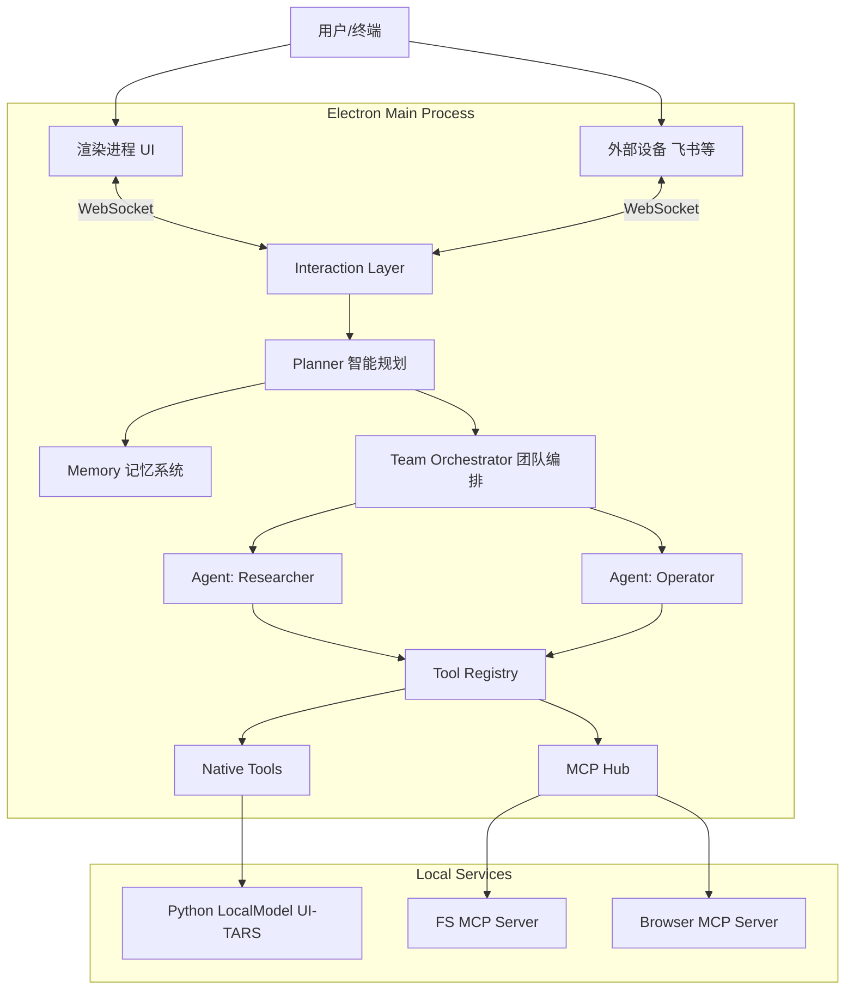

# z-one Codebase Overview

本文档旨在为开发者提供 `z-one` 项目的详细技术概览，帮助快速理解项目结构、核心模块依赖关系及关键业务流程。

## 1. 项目简介

`z-one` 是一个基于 **Electron** 构建的分布式 AI 代理（Agent）协作系统。它不仅仅是一个聊天机器人，更是一个能够操作桌面、浏览器和外部设备的智能中枢。

**核心特性：**
*   **多 Agent 协作 (Swarm)**: 能够根据任务复杂度自动组建 Agent 团队，分工协作。
*   **跨平台交互**: 支持桌面应用、浏览器插件、飞书机器人等多种终端接入。
*   **本地感知能力**: 集成 `localModel` (UI-TARS)，具备屏幕视觉理解和 GUI 自动化能力。
*   **长期记忆 (RAG)**: 内置向量数据库，支持基于语义的历史记录检索。

## 2. 技术架构

项目采用经典的 **Electron (Main + Renderer)** 架构，并引入了 **Interaction Layer** 作为中枢神经。



## 3. 目录结构说明

```
z-one/
├── localModel/             # Python 本地模型服务 (UI-TARS)
│   ├── app.py              # FastAPI 服务入口
│   └── requirements.txt    # Python 依赖
├── src/
│   ├── main/               # Electron 主进程 (核心业务逻辑)
│   │   ├── agent/          # Agent 基类与实现
│   │   ├── control/        # 任务管理与 MCP 连接
│   │   ├── device/         # 外部设备接入 (如 Lark)
│   │   ├── execution/      # 工具执行层 (Native & MCP)
│   │   ├── intelligence/   # 智能规划与分诊 (Planner, Triage)
│   │   ├── interaction/    # WebSocket 交互层
│   │   ├── memory/         # 向量记忆与文件存储
│   │   ├── model/          # LLM 服务适配器
│   │   ├── team/           # 多 Agent 编排 (Swarm)
│   │   ├── db.ts           # SQLite 数据库管理
│   │   └── index.ts        # 主进程入口
│   ├── preload/            # Electron 预加载脚本
│   └── renderer/           # Electron 渲染进程 (React UI)
│       ├── src/
│       │   ├── components/ # UI 组件 (SwarmBoard, ChatInput)
│       │   ├── services/   # 前端服务 (WebSocket Client)
│       │   └── hooks/      # React Hooks (useSessions)
│       └── index.html
├── workspace/              # 运行时生成的文件 (日志, 记忆, 任务)
├── electron.vite.config.ts # 构建配置
└── package.json            # 项目依赖
```

## 4. 核心模块详解 (src/main)

### 4.1 Interaction (交互层)
*   **路径**: `src/main/interaction/`
*   **职责**: 系统的门户。启动 WebSocket 服务（默认端口 18888），统一管理所有连接（Renderer, External Devices）。
*   **关键类**: `InteractionManager`。它处理鉴权、心跳、消息路由，将收到的 `Input` 转发给 `Planner`。

### 4.2 Intelligence (智能层)
*   **路径**: `src/main/intelligence/`
*   **职责**: 系统的“大脑”。
*   **关键组件**:
    *   `Planner`: 接收用户输入，协调记忆检索和任务分发。
    *   `TriageAgent`: 任务分诊。判断任务是简单对话还是需要复杂编排，决定是否启动 `TeamOrchestrator`。

### 4.3 Team (编排层)
*   **路径**: `src/main/team/`
*   **职责**: 实现 **Swarm 模式**。
*   **流程**: 当任务复杂时，`TeamOrchestrator` 会生成 `TeamPlan`，动态创建所需的 Agent 角色（如 "Web Researcher", "Code Reviewer"），并管理它们的并行或串行执行。

### 4.4 Agent (代理层)
*   **路径**: `src/main/agent/`
*   **职责**: 定义 Agent 的行为规范。
*   **实现**: 封装了 LLM 的 ReAct 循环（思考-行动-观察），管理对话历史上下文（支持 Context Compression），并调用工具。

### 4.5 Execution (执行层)
*   **路径**: `src/main/execution/`
*   **职责**: 工具的注册与执行。
*   **ToolRegistry**: 统一管理 Native Tools 和 MCP Tools。
*   **Tools**:
    *   `browser/`: Playwright 浏览器自动化。
    *   `desktop/`: 桌面控制能力。
    *   `tars/`: UI-TARS 视觉操作工具。
    *   `mcp-hub.ts`: 连接外部 MCP Server。

### 4.6 Memory (记忆层)
*   **路径**: `src/main/memory/`
*   **职责**: 长短期记忆管理。
*   **实现**:
    *   `MemoryManager`: 核心管理类。
    *   `indexer.ts`: 负责将文件（Markdown, Code）切片并存入向量库。
    *   `store.ts`: 基于 `sqlite-vec` 和 `better-sqlite3` 实现的本地向量存储。

## 5. 关键数据流

### 用户指令处理流程
1.  **Renderer**: 用户输入 -> `interaction-client.ts` 通过 WebSocket 发送。
2.  **Main (Interaction)**: 收到消息 -> 路由给 `Planner`。
3.  **Main (Planner)**:
    *   记录 Input 到 `FileSessionStore`。
    *   调用 `MemoryManager` 检索相关上下文 (RAG)。
    *   调用 `TriageAgent` 分析意图。
4.  **Main (Team/Agent)**:
    *   若需执行任务，`TeamOrchestrator` 分解任务。
    *   实例化特定 `Agent`。
    *   `Agent` 生成 Tool Call。
5.  **Main (Execution)**:
    *   `ToolRegistry` 找到对应工具。
    *   执行工具（可能是本地函数，也可能是 MCP 调用）。
    *   返回结果给 `Agent`。
6.  **Main (Response)**:
    *   `Agent` 根据工具结果生成最终回复。
    *   `InteractionManager` 将回复推送到 WebSocket。
7.  **Renderer**: 界面更新，显示回复和中间步骤（SwarmBoard）。

## 6. 本地模型服务 (localModel)

*   **路径**: `localModel/`
*   **技术栈**: Python, FastAPI, PyTorch, Qwen2-VL / UI-TARS。
*   **作用**: 提供基于视觉的 GUI 元素识别和坐标生成能力。
*   **交互**: 主进程截图 -> 发送 HTTP 请求给 `localModel` -> 返回 `(x, y, action)` -> 主进程执行鼠标/键盘操作。

**启动方式**:
```bash
cd localModel
# 推荐使用虚拟环境
python3 -m venv venv
source venv/bin/activate
pip install -r requirements.txt
python app.py
```

## 7. 数据库 (SQLite)

*   **文件**: `z-one.db` (配置), `z-one-memory.sqlite` (向量记忆)
*   **位置**: 系统 User Data 目录（macOS 下通常在 `~/Library/Application Support/z-one/`）。
*   **主要表**:
    *   `settings`: 全局配置。
    *   `models`: LLM 模型配置。
    *   `devices`: 已连接设备列表。
    *   `fragments` & `vec_fragments`: 记忆切片与向量索引。

---
*生成时间: 2026-03-15*
