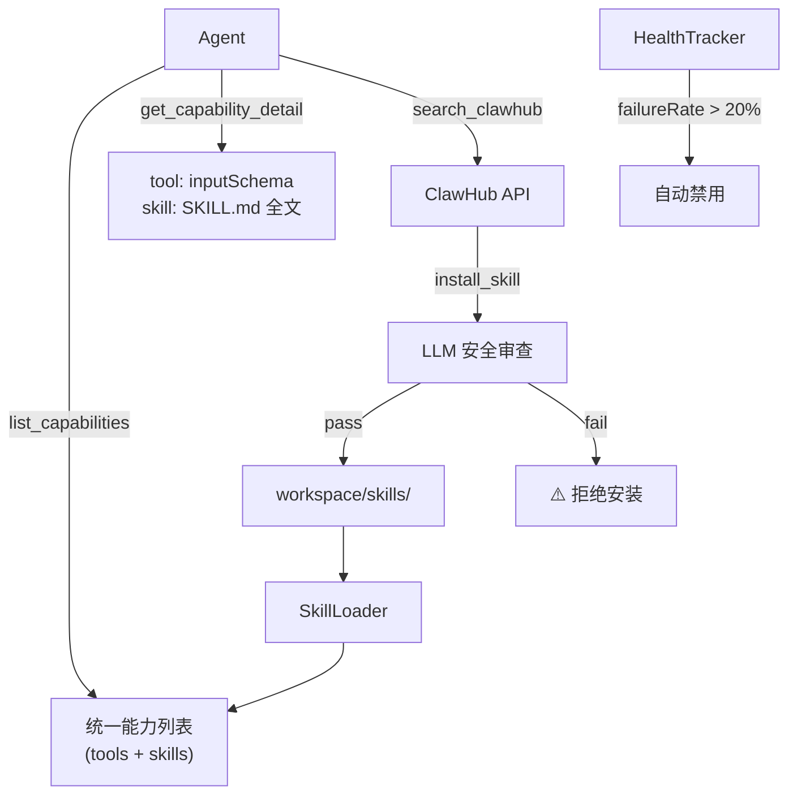
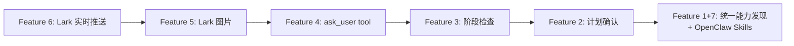

# Z-One System Architecture Redesign

## Problem Statement

当前系统存在以下问题：
1. 每次将全部工具输入给 LLM → 浪费 token，效率低
2. 计划生成后直接执行，不经用户确认
3. 阶段执行失败后 Planner 无检查/重试机制
4. SubAgent 无法与用户交互（登录、验证码等场景）
5. Lark 不支持发送图片
6. Lark 只在全部完成后才回复，缺少实时阶段进展
7. 仅支持 Native/MCP 工具，不支持社区 Skill 生态（OpenClaw/ClawHub）

## Feature Breakdown (7 Features, 按优先级)

---

### Feature 1: Tool Discovery — 按需注入工具

> **核心思路**: Team Leader (prompt) 仍然在 planning 阶段看到完整工具列表（精简版），但 Agent 执行时只拿到分配的工具。新增 `list_tools` / `get_tool_detail` 两个 meta-tool 供 Agent 在执行中发现更多工具。

#### [NEW] [tool-discovery.ts](file:///Users/tj/workspace/z-one/src/main/execution/tools/native/tool-discovery.ts)

两个 native tools：

| Tool | Description |
|------|-------------|
| `list_tools` | 分页返回工具列表（name + 简要 description），每页 50 条 |
| `get_tool_detail` | 根据 toolName 返回完整 inputSchema |

```typescript
// list_tools args: { page?: number }
// Returns: { tools: [{name, description}], page, totalPages, totalTools }

// get_tool_detail args: { toolName: string }
// Returns: { name, description, inputSchema } or { error }
```

#### [MODIFY] [orchestrator.ts](file:///Users/tj/workspace/z-one/src/main/team/orchestrator.ts)

- Team Leader planning prompt 改用精简的工具列表（只有 name + 一句话 description），不含 inputSchema
- `list_tools` 和 `get_tool_detail` 自动注入每个 Agent 的工具列表

#### [MODIFY] [native/index.ts](file:///Users/tj/workspace/z-one/src/main/execution/tools/native/index.ts)

- 注册新的 tool-discovery tools

---

### Feature 2: 计划确认 — 用户审批后再执行

> **核心思路**: 新增 `requirePlanApproval` 配置项。TeamOrchestrator 生成计划后，将计划发送给用户设备，等待确认后再执行。

#### [MODIFY] [settings.ts](file:///Users/tj/workspace/z-one/src/renderer/src/types/settings.ts)

- `AppSettings.general` 新增 `requirePlanApproval?: boolean`

#### [MODIFY] [orchestrator.ts](file:///Users/tj/workspace/z-one/src/main/team/orchestrator.ts)

`executeMission` 中 plan 解析后：
1. 通过 `onSwarmEvent` 发送计划详情给设备
2. 如果 `requirePlanApproval === true`：
   - 发送 `plan_approval_request` 消息给设备
   - 等待用户回复（通过 Promise + resolve callback）
   - 支持 `approve` / `reject` / `modify`
3. 否则直接执行（当前行为）

#### [MODIFY] [interaction/manager.ts](file:///Users/tj/workspace/z-one/src/main/interaction/manager.ts)

- 新增 `plan_approval_response` 消息类型处理
- 路由到 orchestrator 的等待 Promise

#### [MODIFY] Lark 侧

- `handleManagerMessage` 增加 `plan_approval_request` case
- 将计划格式化为 Lark Card 发送给用户
- 接收用户确认回复，转发为 `plan_approval_response`

---

### Feature 3: 阶段检查 — Planner 验证执行结果

> **核心思路**: 每个 stage 执行完后，Planner 用 LLM 评估结果：成功则继续，失败则重试或调整计划。

#### [MODIFY] [orchestrator.ts](file:///Users/tj/workspace/z-one/src/main/team/orchestrator.ts)

在 stage 循环中（`for (const stage of plan.mission)`），每个 stage 的 `Promise.all` 完成后：

```
stageResults = await Promise.all(stagePromises)
↓
stageVerification = await this.verifyStageResults(stage, stageResults, modelConfig)
↓
if (stageVerification.success) → continue to next stage
if (stageVerification.retry)  → re-execute failed tasks (max 1 retry)
if (stageVerification.abort)  → stop and return error summary
```

新增 `verifyStageResults` 方法：
- 调用 LLM 评估每个 task result 是否满足 task description
- 返回 `{success, failedTasks[], suggestion}`
- 失败的 task 重新执行，将错误信息注入 context

---

### Feature 4: SubAgent ↔ 用户实时通信

> **核心思路**: 新增 `ask_user` native tool，SubAgent 可以发送消息/图片给用户并等待回复。同时每个 stage 完成后立即推送阶段结果。

#### [NEW] [user-interaction.ts](file:///Users/tj/workspace/z-one/src/main/execution/tools/native/user-interaction.ts)

```typescript
// ask_user tool
// args: { message: string, imageBase64?: string, waitForReply?: boolean }
// 行为：
//   1. 通过 onSwarmEvent 将消息推送到设备
//   2. 如果 waitForReply=true，阻塞等待用户回复（Promise + MessageQueue callback）
//   3. 返回用户的回复内容
```

#### [MODIFY] [orchestrator.ts](file:///Users/tj/workspace/z-one/src/main/team/orchestrator.ts)

- 每个 task 完成后，通过 `onStatus` / `onSwarmEvent` 发送阶段结果
- 结果格式化为用户友好的 markdown

#### [MODIFY] [interaction/manager.ts](file:///Users/tj/workspace/z-one/src/main/interaction/manager.ts)

- 新增 `user_reply` 消息类型
- 路由到 pending ask_user Promise

---

### Feature 5: Lark 图片上传 & 发送 + 实时阶段推送

> **核心思路**: Lark 侧支持上传图片并在 Card 中嵌入图片。每个阶段完成后立即发送结果卡片。

#### [MODIFY] [lark.ts](file:///Users/tj/workspace/z-one/src/main/device/lark.ts)

**图片能力**:
```typescript
// 新增 uploadImage 方法
// 使用 larkClient.im.v1.image.create 上传 base64 图片
// 返回 image_key

// 新增 sendImage 方法
// 使用 image msg_type 或在 Card 中嵌入 img tag
```

**实时阶段推送**:
- `handleManagerMessage` 中处理新的 chunk 类型：
  - `stage_result`: 格式化为 Lark Card，包含 agent 名称、任务、结果
  - `ask_user`: 将请求格式化为 Card，等待回复
  - `plan_approval_request`: 格式化计划为 Card

**美观格式**:
- 使用 Lark Card `markdown` element
- 每个 stage 一张 Card，包含 ✅/❌ 状态

---

### Feature 6: Lark 从单次回复改为流式消息

> **核心思路**: 当前 Lark 只在最后发送一条消息。改为：收到消息 → 🤔 emoji → 每阶段完成发卡片 → 最终总结。

#### [MODIFY] [lark.ts](file:///Users/tj/workspace/z-one/src/main/device/lark.ts)

- `handleManagerMessage` 中区分 `isChunk` 的不同子类型：
  - `swarmState` 变更 → 发送/更新进度 Card
  - `stage_result` → 新发一条阶段结果 Card
  - `ask_user` → 发送交互请求 Card
- 最终结果仍然作为 reply 发送

---

### Feature 7: OpenClaw/ClawHub Skills 集成

> **核心思路**: 让 Z-One 支持 OpenClaw 的 Skill 生态。Skills 不是可执行工具，而是 **LLM 提示词指令**（教 Agent 如何使用 CLI 工具）。通过 ClawHub 浏览/安装 Skill，安装前用 LLM 进行安全审查。

#### 研究发现

通过阅读 OpenClaw 源码（`workspace.ts` 936 行 + docs），确认 Skill 体系如下：

| 概念 | 说明 |
|------|------|
| **Skill** | 一个包含 `SKILL.md` 的文件夹，YAML frontmatter 定义 `name`、`description`、`metadata` |
| **不是工具** | Skill 是**提示词注入**（教 Agent 如何用 `curl`/`gh`/`bash` 等 CLI），不是 function-call 工具 |
| **ClawHub** | 公共 Skill 注册中心，通过 `clawhub` CLI 进行 search/install/update |
| **Gating** | 根据 `requires.bins`、`requires.env`、`os` 等条件在加载时过滤 |

> [!IMPORTANT]
> **不采用 OpenClaw 的全量 XML 注入方式。** OpenClaw 将所有 eligible skills 以 XML 格式一次性注入 system prompt，这在 skills 数量大时会严重浪费 token。我们改用 **按需加载** 的方式：system prompt 中只注入一小段目录摘要（name + 一句话），Agent 通过 `read_skill` tool 按需读取具体 skill 的完整内容。

#### 统一发现机制 — 解决 Feature 1 的 AI 混淆问题

> [!WARNING]
> **取消 Feature 1 中独立的 `list_tools` / `get_tool_detail`，改为统一的能力发现工具集。** 原方案中 Tool Discovery 和 `skill_search` 是两套独立系统，Agent 需要判断用 native tool 还是 skill，容易混淆。新方案统一为：

| 统一工具 | 功能 |
|----------|------|
| `list_capabilities` | 分页返回所有可用能力（native tools + MCP tools + 已安装 skills），每页 50 条，只含 name + 一句话 description + type (tool/skill) |
| `get_capability_detail` | 根据 name 返回详情：tool 返回 inputSchema，skill 返回 SKILL.md 全文 |
| `search_clawhub` | 搜索 ClawHub 社区 skill（仅用于发现新 skill，不含已安装的） |
| `install_skill` | 下载 → LLM 安全审查 → 安装 |

这样 Agent 只需调用 `list_capabilities` 就能看到所有可用能力的统一列表，无需区分 tool 和 skill。

#### Skill 按需加载（非全量注入）

```
System Prompt 中只注入：
"你可以使用 list_capabilities 工具查看所有可用能力（工具+技能）。
 当前已安装 N 个 skill：github, weather, slack, ..."
（约 200 tokens，不随 skill 数量线性增长）

Agent 需要某个 skill 时：
→ 调用 get_capability_detail("github")
→ 返回完整 SKILL.md 内容
→ Agent 根据内容执行 CLI 命令
```

#### Skill 健康管理 — 自动淘汰 + 手动禁用

> [!IMPORTANT]
> **新增 Skill 健康跟踪系统。** 每个 skill 维护调用统计，失败率超过阈值自动禁用。

**自动淘汰机制** (`health-tracker.ts`):
```
SkillHealth {
  name: string
  totalCalls: number         // 总调用次数
  failedCalls: number        // 失败次数
  failureRate: number        // 失败率 = failedCalls / totalCalls
  status: "active" | "warned" | "retired"
  lastUsed: number           // 最后使用时间
}

规则（最少 5 次调用后生效）：
- failureRate > 10% → status = "warned"（通知用户）
- failureRate > 20% → status = "retired"（自动禁用）
- retired 的 skill 不出现在 list_capabilities 结果中
- 用户可手动重新启用
```

**手动管理** (DB 持久化 + UI)：

| 能力 | 实现 |
|------|------|
| 禁用/启用 | DB 中 `skill_status` 表，`enabled: boolean` |
| 删除 | 从 `workspace/skills/` 删除目录 + 清理 DB 记录 |
| 管理 tools | `skill_disable`, `skill_enable`, `skill_delete` native tools |
| UI | Settings Modal 新增 Skills 标签页，列出所有已安装 skill + 状态 + 失败率 + 启用/禁用/删除按钮 |

#### 架构设计（修订后）



#### [NEW] [skills/](file:///Users/tj/workspace/z-one/src/main/skills/) — 新模块

| 文件 | 职责 |
|------|------|
| `loader.ts` | 从 `workspace/skills/` 加载 SKILL.md，解析 frontmatter，按 gating + enabled 过滤 |
| `reviewer.ts` | 安装前用 LLM 审查 SKILL.md 内容 |
| `health-tracker.ts` | 调用统计、失败率计算、自动淘汰逻辑 |
| `types.ts` | `SkillEntry`、`SkillHealth` 等类型定义 |

#### [NEW] [skill-tools.ts](file:///Users/tj/workspace/z-one/src/main/execution/tools/native/skill-tools.ts)

| Tool | Description |
|------|-------------|
| `search_clawhub` | 搜索 ClawHub 社区 skill |
| `install_skill` | 下载 → 审查 → 安装 |
| `skill_disable` / `skill_enable` | 手动禁用/启用 |
| `skill_delete` | 删除已安装 skill |

#### [MODIFY] [db.ts](file:///Users/tj/workspace/z-one/src/main/db.ts) / [settings.ts](file:///Users/tj/workspace/z-one/src/renderer/src/types/settings.ts)

- 新增 `installed_skills` 和 `skill_health` 表

#### [MODIFY] [SettingsModal.tsx](file:///Users/tj/workspace/z-one/src/renderer/src/components/SettingsModal.tsx)

- 新增 Skills 管理标签页

---

## Feature 1 修订说明

> [!WARNING]
> Feature 1 (Tool Discovery) 的 `list_tools` / `get_tool_detail` 已合并入 Feature 7 的统一能力发现工具 `list_capabilities` / `get_capability_detail`。不再作为独立 Feature 实现。

---

## Implementation Order



> [!IMPORTANT]
> Feature 1 和 Feature 7 合并为一个 Feature 实施（统一能力发现 + OpenClaw 集成）。

## Key Design Decisions Needing Input

1. **ask_user 超时**: SubAgent 等待用户回复的超时时间？建议 5 分钟
2. **阶段重试次数**: 失败 stage 最多重试几次？建议 1 次
3. **计划确认时 Lark 交互**: 文字回复（"确认" / "取消"）还是 Card action button？建议文字回复
4. **Skill 自动淘汰阈值**: 10% warning / 20% retire？最少调用 5 次后生效？
5. **Skill 安全审查模型**: 用 active model 做审查？建议 active model + 严格 prompt
6. **Skill 安装目录**: `workspace/skills/`（与 OpenClaw 兼容）？
7. **ClawHub API**: 搜索和下载是公开的，不需要 auth

## Verification Plan

### Automated Tests
- 统一能力发现 tools 测试（分页、类型过滤）
- `verifyStageResults` 用 mock LLM 测试
- Skill loader frontmatter 解析和 gating 过滤
- Skill reviewer 恶意内容检测
- HealthTracker 自动淘汰逻辑

### Manual Verification
1. Lark 发消息 → 🤔 → 每阶段 Card → 最终总结
2. `requirePlanApproval=true` → 计划 → 确认 → 执行
3. `ask_user` → Lark 交互 → Agent 继续
4. Stage 失败 → 验证检查和重试
5. `search_clawhub "weather"` → `install_skill weather` → 审查 → 安装 → Agent 使用
6. Skill 连续失败 → 自动 warned/retired → UI 显示状态 → 手动重新启用

