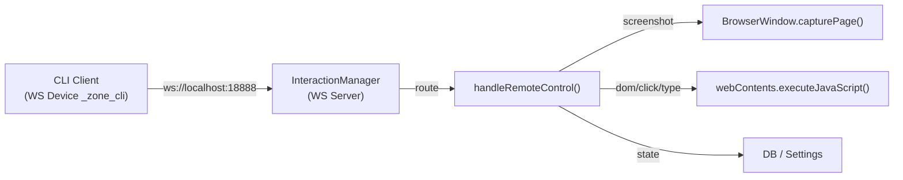

# CLI 远程控制系统 — 实现方案 v2

## 架构



CLI 复用已有 WS 设备架构，注册为 `_zone_cli` 内部设备。

---

## 一、紧凑 DOM 查询设计

### 设计原则

| 目标 | 策略 |
|------|------|
| **省 token** | 单字母 key、剪枝无用节点、文本截断 |
| **准确定位** | 每个节点附带唯一 CSS selector path |
| **可操作** | 包含 bounding rect，既能用 selector 又能用坐标操作 |

### 数据格式

```typescript
// 一个 DOM 节点的紧凑表示（~50 tokens/节点 vs HTML ~200+ tokens/节点）
interface CompactNode {
  s: string;          // selector — 唯一 CSS path（如 ".sidebar > button:nth-child(2)"）
  t: string;          // tag（div, button, input...）
  tx?: string;        // 可见文本（截断50字符，仅叶节点）
  // 属性（仅非空时出现）
  id?: string;
  cls?: string;       // className 前3个 class
  val?: string;       // input/select 的 value
  ph?: string;        // placeholder
  tp?: string;        // input type
  chk?: boolean;      // checkbox/radio 是否选中
  dis?: boolean;      // disabled
  // 位置（仅开启时）
  r?: [number, number, number, number]; // [x, y, w, h]
  // 子节点
  ch?: CompactNode[];
}
```

### 三级查询模式

```
z-one dom                          # skeleton — 仅交互元素 + 文本节点
z-one dom --full                   # full — 所有可见元素
z-one dom --selector ".sidebar"    # scoped — 指定范围
z-one dom --interactive            # interactive-only — 仅 button/input/select/a/textarea
```

#### `skeleton` 模式（默认） — 最省 token

**保留规则：**
1. 交互元素：`button`, `input`, `select`, `textarea`, `a[href]`, `[role=button]`, `[onclick]`
2. 有 [id](file:///Users/tj/workspace/z-one/src/renderer/src/components/Sidebar.tsx#19-98) 或 `data-testid` 的元素
3. 有直接文本内容且 text.length > 0 的叶节点
4. 以上元素的最短路径祖先（保持树结构但折叠中间层）

**剪枝规则：**
1. `display: none` / `visibility: hidden` / `opacity: 0` → 跳过
2. `<svg>`, `<path>`, `<circle>` 等图形元素 → 折叠为 `{t:"svg"}`
3. `<style>`, `<script>`, `<noscript>` → 跳过
4. 空 `<div>` / `<span>`（无文本、无交互子节点）→ 跳过
5. 纯装饰类（`lucide-*` 等 icon class）→ 仅保留 `{t:"svg"}`

#### `interactive` 模式 — 最精简

只返回可交互元素的 flat 列表（非树结构），每个包含 selector + 文字 + 类型：

```json
[
  {"s": ".sidebar-tab:nth-child(1)", "t": "button", "tx": "Chat"},
  {"s": ".sidebar-tab:nth-child(2)", "t": "button", "tx": "Workflows"},
  {"s": ".new-chat-btn", "t": "button", "tx": "New Chat"},
  {"s": ".icon-btn:nth-child(1)", "t": "button", "tx": ""},
  {"s": ".chat-textarea", "t": "textarea", "ph": "Type a message..."},
  {"s": ".model-selector", "t": "select", "val": "gpt-4"}
]
```

> [!IMPORTANT]
> Skeleton 模式返回约 **200-500 tokens**（vs 原生 HTML 5000-10000+ tokens），精简 **90%+**，同时保证每个元素可通过 `s` 字段直接定位操作。

### Selector 生成算法

注入前端的 JS 为每个节点生成最短唯一 selector：
1. 有 [id](file:///Users/tj/workspace/z-one/src/renderer/src/components/Sidebar.tsx#19-98) → `#myId`
2. 有唯一 `className` → `.unique-class`
3. 否则 → `parent > tag:nth-child(n)` 递归

---

## 二、结构化测试框架

### 测试用例格式

```typescript
interface TestSuite {
  name: string;
  description: string;
  setup?: TestStep[];       // 前置操作（启动、等待）
  teardown?: TestStep[];    // 清理
  cases: TestCase[];
}

interface TestCase {
  id: string;               // "TC001"
  name: string;
  steps: TestStep[];
}

interface TestStep {
  action: string;           // CLI 命令: screenshot | dom | click | type | scroll | eval | wait | assert
  params: Record<string, any>;
  assert?: Assertion[];     // 验证条件
  timeout?: number;         // 超时(ms)
  onFail?: "stop" | "continue";  // 失败策略
}

interface Assertion {
  type: "contains" | "not_contains" | "equals" | "exists" | "count" | "screenshot_match";
  target: string;           // 结果中的字段 / JSONPath
  expected: any;
}
```

### 测试用例示例

```json
{
  "name": "Z-One 核心功能测试",
  "cases": [
    {
      "id": "TC001",
      "name": "应用启动 — 界面正常渲染",
      "steps": [
        { "action": "wait", "params": { "ms": 2000 } },
        { "action": "screenshot", "params": { "save": "tc001_startup.png" } },
        { "action": "dom", "params": { "mode": "interactive" },
          "assert": [
            { "type": "exists", "target": "$..[?(@.cls=='sidebar-tab')]", "expected": true },
            { "type": "exists", "target": "$..[?(@.cls=='new-chat-btn')]", "expected": true },
            { "type": "exists", "target": "$..[?(@.t=='textarea')]", "expected": true }
          ]
        }
      ]
    },
    {
      "id": "TC002",
      "name": "侧边栏 — Chat/Workflow 切换",
      "steps": [
        { "action": "click", "params": { "selector": ".sidebar-tab:nth-child(2)" } },
        { "action": "wait", "params": { "ms": 500 } },
        { "action": "dom", "params": { "selector": ".main-content", "mode": "skeleton" },
          "assert": [
            { "type": "exists", "target": "$..[?(@.cls=~'workflow-list')]", "expected": true },
            { "type": "not_contains", "target": "$..tx", "expected": "Type a message" }
          ]
        },
        { "action": "screenshot", "params": { "save": "tc002_workflow_tab.png" } },
        { "action": "click", "params": { "selector": ".sidebar-tab:nth-child(1)" } },
        { "action": "wait", "params": { "ms": 500 } },
        { "action": "dom", "params": { "selector": ".main-content", "mode": "skeleton" },
          "assert": [
            { "type": "exists", "target": "$..[?(@.t=='textarea')]", "expected": true }
          ]
        }
      ]
    },
    {
      "id": "TC003",
      "name": "设置弹窗 — 打开关闭",
      "steps": [
        { "action": "click", "params": { "selector": ".icon-btn[title='Settings']" } },
        { "action": "wait", "params": { "ms": 300 } },
        { "action": "dom", "params": { "mode": "skeleton" },
          "assert": [
            { "type": "exists", "target": "$..[?(@.cls=~'modal-overlay')]", "expected": true },
            { "type": "exists", "target": "$..[?(@.cls=~'modal-content')]", "expected": true }
          ]
        },
        { "action": "screenshot", "params": { "save": "tc003_settings_open.png" } }
      ]
    }
  ]
}
```

### 测试报告输出

```
═══════════════════════════════════════════════════
  Z-One 核心功能测试
  Run: 2026-03-19 12:50:00
═══════════════════════════════════════════════════

✅ TC001 应用启动 — 界面正常渲染                    1.8s
✅ TC002 侧边栏 — Chat/Workflow 切换                2.1s
❌ TC003 设置弹窗 — 打开关闭                         0.9s
   ├─ Step 1: click .icon-btn[title='Settings']    ✅
   ├─ Step 2: wait 300ms                           ✅
   └─ Step 3: dom skeleton                         ❌
      Assertion FAILED: exists("$..[?(@.cls=~'modal-overlay')]")
      Expected: true
      Got: no match in DOM result
      Screenshot: /tmp/z-one-test/tc003_step3_fail.png

───────────────────────────────────────────────────
Result: 2/3 PASSED | 1 FAILED
Screenshots: /tmp/z-one-test/
═══════════════════════════════════════════════════
```

### 测试运行器

```
z-one test run <suite.json>          # 运行测试套件
z-one test run <suite.json> --case TC002  # 运行单个用例
z-one test list <suite.json>         # 列出用例
z-one test report <result.json>      # 查看报告
```

测试运行器内置于 CLI，每个步骤串行执行，失败时自动截图保存。最终生成 JSON 报告 + 文本摘要。

---

## Proposed Changes（文件清单）

### Protocol & Handlers

| 操作 | 文件 | 说明 |
|------|------|------|
| MODIFY | [types.ts](file:///Users/tj/workspace/z-one/src/main/interaction/types.ts) | 增加 `remote_control` / `remote_control_response` 类型 |
| MODIFY | [manager.ts](file:///Users/tj/workspace/z-one/src/main/interaction/manager.ts) | 新增 `handleRemoteControl()` + 所有 action 处理 |

### CLI Client

| 操作 | 文件 | 说明 |
|------|------|------|
| MODIFY | [cli.ts](file:///Users/tj/workspace/z-one/src/main/cli.ts) | 重写为 WS client，新增所有 remote_control 命令 |
| DELETE | [cli-server.ts](file:///Users/tj/workspace/z-one/src/main/cli-server.ts) | 移除 Unix Socket 服务器 |
| MODIFY | [index.ts](file:///Users/tj/workspace/z-one/src/main/index.ts) | 移除 CLIServer；新增 token 文件写入 |

### 测试框架

| 操作 | 文件 | 说明 |
|------|------|------|
| NEW | [cli-test-runner.ts](file:///Users/tj/workspace/z-one/src/main/cli-test-runner.ts) | 测试运行器：解析 JSON、串行执行、断言、报告 |
| NEW | [tests/core.test.json](file:///Users/tj/workspace/z-one/tests/core.test.json) | 核心功能测试套件 |

### DOM 查询脚本

| 操作 | 文件 | 说明 |
|------|------|------|
| NEW | [interaction/dom-query.ts](file:///Users/tj/workspace/z-one/src/main/interaction/dom-query.ts) | 紧凑 DOM 序列化：注入前端的 JS 生成器 |

---

## Verification Plan

1. `z-one dom --interactive` 返回 flat list，token 数 < 500
2. `z-one screenshot` 保存 PNG 且文件 > 10KB
3. `z-one click ".sidebar-tab:nth-child(2)"` 后 DOM 中出现 `workflow-list`
4. `z-one test run core.test.json` 全部通过
