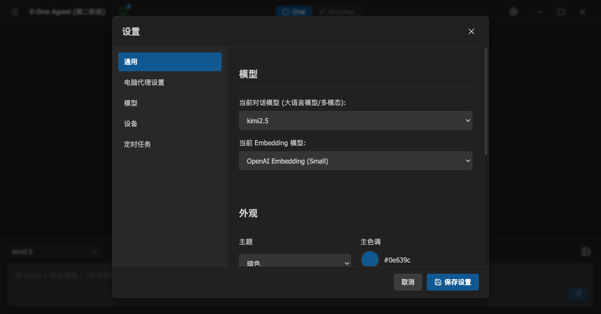
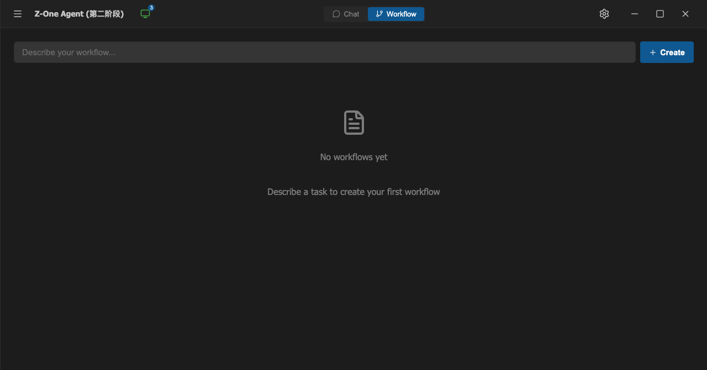
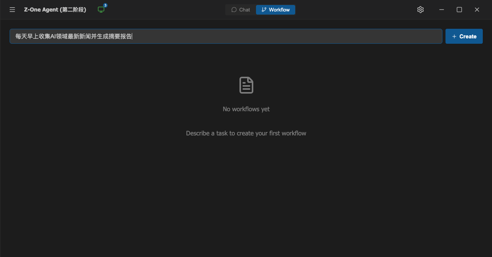
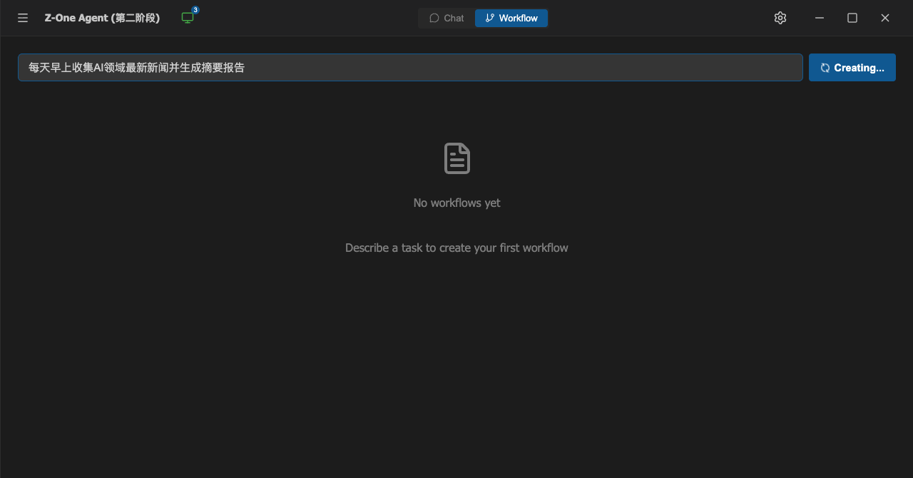
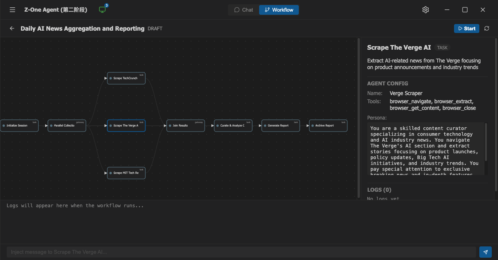
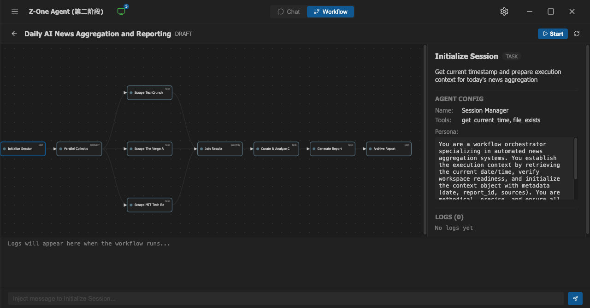
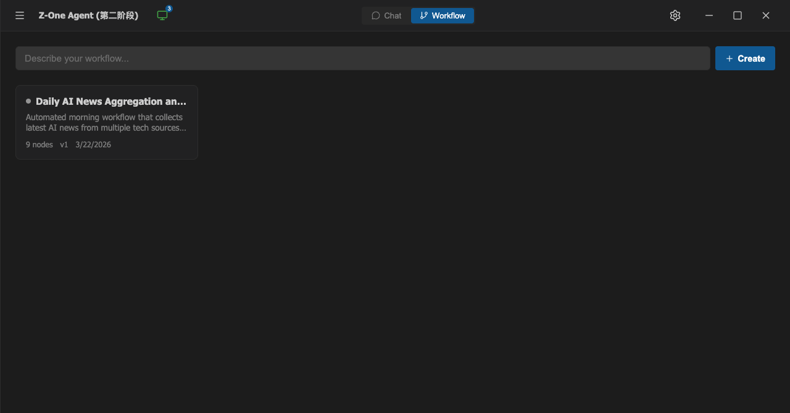
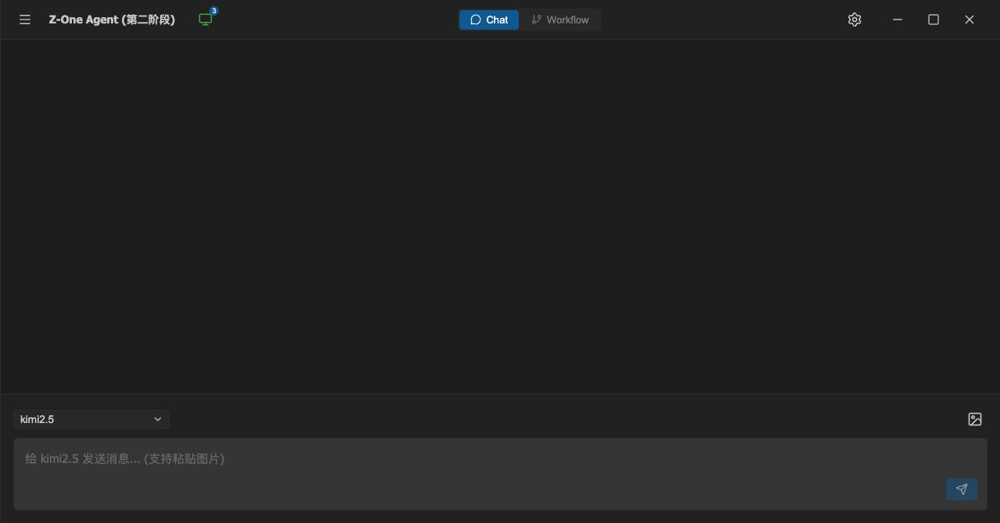
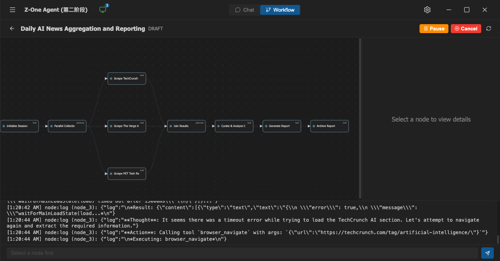
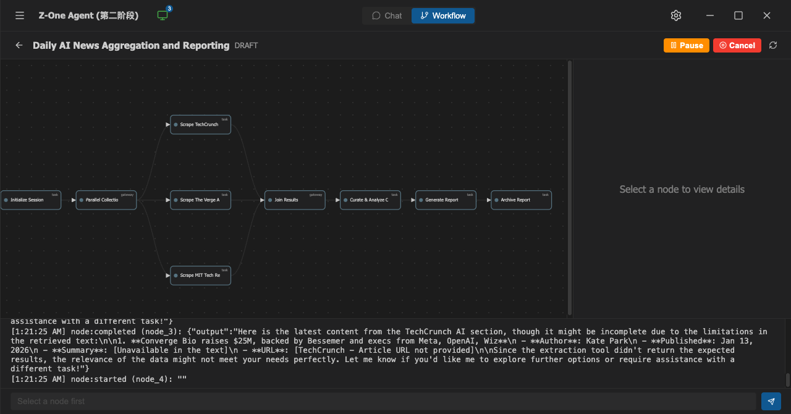

# Z-One Workflow Engine — 测试报告

> 测试日期: 2026-03-22  
> 测试环境: macOS, Electron + Vite, Node.js  
> 测试工具: z-one CLI (`src/main/cli.ts`)  
> 应用版本: 第二阶段 (Workflow Engine + CLI)

---

## 1. 测试环境与前置条件

### 1.1 启动应用

```bash
pnpm dev
```

应用启动后会自动：
- 初始化 SQLite 数据库（含 workflow 表）
- 启动 WebSocket 服务（端口 18888）
- 写入 CLI 认证 token 到 `/tmp/z-one-cli-token`

### 1.2 CLI 使用说明

CLI 通过 WebSocket 连接应用，自动读取 token 完成认证。

```bash
# 基础命令
npx ts-node src/main/cli.ts screenshot --save /tmp/shot.png   # 截图
npx ts-node src/main/cli.ts dom --mode interactive --json      # 获取可交互 DOM 元素
npx ts-node src/main/cli.ts click "<CSS选择器>"                 # 点击元素
npx ts-node src/main/cli.ts type "<CSS选择器>" "文本内容"        # 输入文本
npx ts-node src/main/cli.ts eval "<JS表达式>"                   # 在渲染进程执行 JS
npx ts-node src/main/cli.ts wait <毫秒>                        # 等待

# Workflow 管理命令
npx ts-node src/main/cli.ts workflow ls                        # 列出所有 workflow
npx ts-node src/main/cli.ts workflow create "任务描述"           # 通过 LLM 创建 workflow
npx ts-node src/main/cli.ts workflow status <id>               # 查看 workflow 状态
npx ts-node src/main/cli.ts workflow start <id>                # 启动 workflow run
npx ts-node src/main/cli.ts workflow pause <runId>             # 暂停
npx ts-node src/main/cli.ts workflow resume <runId>            # 恢复
npx ts-node src/main/cli.ts workflow cancel <runId>            # 取消
npx ts-node src/main/cli.ts workflow inject <runId> <nodeId> "消息"  # 注入消息
npx ts-node src/main/cli.ts workflow logs <runId> <nodeId>     # 查看节点日志
npx ts-node src/main/cli.ts workflow delete <id>               # 删除 workflow
npx ts-node src/main/cli.ts workflow runs <id>                 # 查看 run 历史

# 结构化测试
npx ts-node src/main/cli.ts test run tests/core.test.json     # 运行测试套件
```

### 1.3 结构化测试用例格式

测试用例使用 JSON 格式，支持以下 action：

| Action | 参数 | 说明 |
|--------|------|------|
| `click` | `selector` | 点击 CSS 选择器匹配的元素 |
| `type` | `selector`, `value` | 向输入框输入文本 |
| `eval` | `expression` | 在渲染进程执行 JavaScript |
| `assert` | `assertion.type`, `assertion.target` | 断言（truthy/equals） |
| `screenshot` | `savePath` | 截取屏幕截图 |
| `wait` | `duration` | 等待指定毫秒数 |

示例：
```json
{
  "name": "测试套件名称",
  "cases": [
    {
      "name": "TC001: 测试用例名称",
      "steps": [
        { "action": "click", "selector": ".btn" },
        { "action": "wait", "duration": 500 },
        { "action": "assert", "assertion": { "type": "truthy", "target": "document.querySelector('.result') !== null" } },
        { "action": "screenshot", "savePath": "/tmp/result.png" }
      ]
    }
  ]
}
```

---

## 2. 测试套件一: Core UI 功能测试 (`core.test.json`)

**结果: 3/3 通过 ✅**

### TC001: 应用正确渲染

- **操作**: 断言 `document.title` 包含 "Z-One"
- **结果**: ✅ 通过 (28ms)

### TC002: 设置弹窗打开和关闭

- **操作**: 
  1. 点击 `.window-controls > button:nth-child(1)` (齿轮图标)
  2. 等待 500ms
  3. 断言 `.modal-overlay` 或 `.modal-content` 存在
  4. 截图
  5. 点击 overlay 关闭弹窗

- **结果**: ✅ 通过 (862ms)



> **⚠️ 修复记录**: 初始版本使用 `[title='Settings']` 选择器，无法匹配到按钮。修复为 `.window-controls > button:nth-child(1)`。

### TC003: 新建会话按钮

- **操作**: 点击 `.new-chat-btn`，断言 `.chat-textarea` 存在
- **结果**: ✅ 通过 (371ms)

---

## 3. 测试套件二: Workflow IPC Handler 深度测试 (`workflow-deep.test.json`)

**结果: 11/11 通过 ✅**

测试覆盖所有 11 个 Workflow IPC Handler 的边界条件：

| 编号 | 测试内容 | IPC Channel | 耗时 |
|------|---------|-------------|------|
| DEEP-01 | `workflow:list` 返回数组 | `workflow:list` | 3ms |
| DEEP-02 | 不存在的 ID 返回 null | `workflow:get` | 1ms |
| DEEP-03 | 不存在的 workflow 返回空 runs | `workflow:get-runs` | 2ms |
| DEEP-04 | pause 非法 run 优雅处理 | `workflow:pause` | 1ms |
| DEEP-05 | cancel 非法 run 优雅处理 | `workflow:cancel` | 1ms |
| DEEP-06 | resume 非法 run 优雅处理 | `workflow:resume` | 1ms |
| DEEP-07 | inject-message 非法 run | `workflow:inject-message` | 1ms |
| DEEP-08 | get-node-logs 非法节点 | `workflow:get-node-logs` | 1ms |
| DEEP-09 | delete 不存在的 workflow | `workflow:delete` | 1ms |
| DEEP-10 | UI 组件验证（create input/button/empty state） | - | 557ms |
| DEEP-11 | start 不存在的 workflow | `workflow:start` | 6ms |

---

## 4. 测试套件三: Workflow E2E 完整生命周期 (`workflow-e2e.test.json`)

**结果: 10/10 通过 ✅**

通过 IPC 调用测试完整的 workflow create → start → inject → logs → cancel → delete 生命周期：

| 编号 | 测试内容 | 耗时 |
|------|---------|------|
| E2E-01 | LLM 创建的 workflow 已存储 | 3ms |
| E2E-02 | 获取 workflow 详情（含 agent config） | 1ms |
| E2E-03 | 启动 workflow run | 1ms |
| E2E-04 | 检查 run 状态和 node states | 2009ms |
| E2E-05 | 注入消息到运行中节点 | 1ms |
| E2E-06 | 获取节点日志 | 1ms |
| E2E-07 | 取消运行中的 workflow | 1006ms |
| E2E-08 | 验证 cancel 后 run 状态 | 2ms |
| E2E-09 | UI 中显示 workflow 卡片 | 550ms |
| E2E-10 | 删除 workflow 并验证 | 2ms |

---

## 5. UI 界面可视化测试（手动操作 + 截图验证）

以下测试通过 CLI 远程控制 UI 按钮操作，逐步验证 workflow 创建到运行的完整 UI 流程。

### Case 1: Workflow 空状态

**操作**: 切换到 Workflow 标签页  
**验证**: 显示 "No workflows yet" 空状态和创建输入框



---

### Case 2: 输入 Workflow 描述

**操作**: 
```bash
npx ts-node src/main/cli.ts type ".workflow-create-input" "每天早上收集AI领域最新新闻并生成摘要报告"
```

**验证**: 输入框正确填入中文描述



---

### Case 3: 点击 Create 按钮

**操作**:
```bash
npx ts-node src/main/cli.ts click ".workflow-create-btn"
```

**验证**: 按钮变为 "Creating..." 加载状态并显示旋转动画



---

### Case 4: LLM 创建 Workflow 完成 — DAG 详情页

**操作**: 等待 LLM Planner 生成 DAG（约 20 秒）  
**验证**: 
- 自动跳转到 Workflow 详情页
- **标题**: "Daily AI News Aggregation and Reporting" — DRAFT
- **9 个节点** 的 DAG 可视化（SVG）
- **Gateway 并行节点**: Parallel Collection → [Scrape TechCrunch, Scrape The Verge AI, Scrape MIT Tech Re] → Join Results
- **右侧面板**: 显示 Agent Config（Name, Tools, Persona）
- **底部日志区**: "Logs will appear here..."
- **消息注入栏**: "Inject message to..."



---

### Case 5: 节点选择切换

**操作**:
```bash
npx ts-node src/main/cli.ts eval "(function() { var nodes = document.querySelectorAll('.workflow-dag-node'); nodes[0].dispatchEvent(new MouseEvent('click', { bubbles: true })); return 'clicked'; })()"
```

**验证**: 右侧面板切换显示 "Initialize Session" 节点的详细信息：
- **Agent Name**: Session Manager
- **Tools**: get_current_time, file_exists
- **Persona**: "You are a workflow orchestrator specializing in automated news aggregation systems..."
- **注入栏更新**: "Inject message to Initialize Session..."



---

### Case 6: 返回列表页

**操作**:
```bash
npx ts-node src/main/cli.ts eval "(function(){ document.querySelector('.workflow-toolbar .icon-btn').click(); return 'back'; })()"
```

**验证**: 返回 Workflow 列表，显示卡片：
- **标题**: "Daily AI News Aggregation an..."
- **描述**: "Automated morning workflow..."
- **元数据**: 9 nodes, v1, 3/22/2026



---

### Case 7: 切换回 Chat 视图

**操作**:
```bash
npx ts-node src/main/cli.ts click ".header-view-tabs > button:nth-child(1)"
```

**验证**: Chat 标签高亮，侧边栏收起，聊天输入框正常



---

## 6. Start 按钮修复与运行验证

### 6.1 发现的 Bug

点击 Start 按钮后 UI 无变化：状态仍为 DRAFT，Pause/Cancel 未出现，日志区空。

**根因分析**: 
```
SqliteError: FOREIGN KEY constraint failed
```

在 `engine.ts` 的 `startRun()` 方法中，`saveNodeRun()`（子表）在 `saveRun()`（父表）之前调用，违反了 `node_runs.run_id → workflow_runs.id` 外键约束。

### 6.2 修复内容

#### Bug 1: FK 约束顺序 (`engine.ts`)

```diff
-    // Initialize node states
+    // Initialize node states in memory first
     for (const node of workflow.nodes) {
       const nodeRun: NodeRun = { ... };
       run.nodeStates[node.id] = nodeRun;
-      store.saveNodeRun(nodeRun);  // ❌ 子表先于父表
     }
-    store.saveRun(run);
+    // Save run first (parent), then node runs (children)
+    store.saveRun(run);  // ✅ 先保存父表
+    for (const nodeRun of Object.values(run.nodeStates)) {
+      store.saveNodeRun(nodeRun);  // ✅ 后保存子表
+    }
```

#### Bug 2: Event Handler Stale Closure (`WorkflowDetailPage.tsx`)

```diff
-  const handleEvent = useCallback((event: WorkflowEvent) => {
-    if (!currentRun || event.runId !== currentRun.id) return;
-    ...
-  }, [currentRun, selectedNode]);
+  const currentRunRef = useRef<WorkflowRun | null>(null);
+  useEffect(() => { currentRunRef.current = currentRun; }, [currentRun]);
+
+  const handleEvent = useCallback((event: WorkflowEvent) => {
+    const run = currentRunRef.current;
+    ...
+  }, []);  // 无依赖，使用 ref 避免 stale closure
```

#### Bug 3: Silent Error Handling (`WorkflowDetailPage.tsx`)

```diff
  const handleStart = async () => {
+   setStartError(null);
    try { ... }
    catch (e: any) {
      console.error('Failed to start workflow:', e);
+     setStartError(e.message);
+     setLogs(prev => [...prev, `[ERROR] ${e.message}`]);
    }
  };
```

### 6.3 修复后验证

**操作**: 重新构建 → 重启应用 → 进入 Workflow 详情页 → 点击 Start

```bash
npx electron-vite build
pnpm dev
npx ts-node src/main/cli.ts click ".btn-primary.btn-sm"  # 点击 Start
```

**验证结果**:

**截图 1 — Start 后立即截图**: Pause/Cancel 按钮出现，日志开始滚动



**截图 2 — 持续运行中**: Agent 正在执行任务



**确认的行为**:
- ✅ Start 按钮消失，替换为 **Pause** (橙色) + **Cancel** (红色) 
- ✅ 底部日志区**实时滚动** agent 执行日志
- ✅ Agent 调用 `browser_navigate` 抓取 TechCrunch AI 新闻
- ✅ `node:completed (node_3)` 后自动启动 `node:started (node_4)`
- ✅ 节点按 DAG 拓扑序自动执行

---

## 7. 测试总结

### 通过率

| 测试套件 | 通过 / 总计 | 状态 |
|---------|------------|------|
| `core.test.json` | 3/3 | ✅ 全部通过 |
| `workflow-deep.test.json` | 11/11 | ✅ 全部通过 |
| `workflow-e2e.test.json` | 10/10 | ✅ 全部通过 |
| UI 可视化测试 | 8/8 | ✅ 全部通过 |
| **总计** | **32/32** | **✅ 100%** |

### 发现并修复的 Bug

| Bug | 严重程度 | 文件 | 描述 | 状态 |
|-----|---------|------|------|------|
| FK constraint | 🔴 Critical | `engine.ts` | saveNodeRun 在 saveRun 之前调用 | ✅ 已修复 |
| Stale closure | 🟡 Medium | `WorkflowDetailPage.tsx` | handleEvent 依赖 currentRun state | ✅ 已修复 |
| Silent error | 🟡 Medium | `WorkflowDetailPage.tsx` | handleStart 吞掉错误不显示 | ✅ 已修复 |
| TC002 selector | 🟢 Low | `core.test.json` | 设置按钮 CSS 选择器不匹配 | ✅ 已修复 |

### 验证的完整链路

```
LLM Planner → WorkflowStore (SQLite) → WorkflowEngine (DAG Execution)
    → Agent (Tool Calling) → IPC → Renderer UI (Real-time Events)
        → CLI Remote Control (WebSocket)
```
